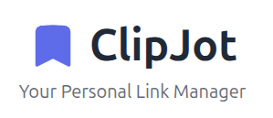

# ClipJot



Save and organize bookmarks from anywhere.

**Production:** [https://clipjot.net](https://clipjot.net)

## About This Repository

This is the **open source** repository for ClipJot, containing:

- **Native clients** for iOS, Android, and Chrome
- **API documentation** and example code
- **Developer resources** for building integrations

The backend server is maintained separately. All clients communicate with the production API at [clipjot.net](https://clipjot.net).

## What is ClipJot?

ClipJot is a bookmark manager that lets you save links with one tap from any app's share sheet, organize with tags, and access your bookmarks from any device.

## Repository Structure

```
clipjot/
├── clients/
│   ├── ios/              # iOS app (Swift/SwiftUI)
│   ├── android/          # Android app (Java)
│   └── chrome-extension/ # Chrome extension
└── docs/
    ├── api/              # REST API specification
    └── examples/         # API client examples
```

## Clients

| Platform | Technology | Features |
|----------|------------|----------|
| **iOS** | Swift, SwiftUI | Share Extension, OAuth, offline support |
| **Android** | Java | Share intent, OAuth, Material Design |
| **Chrome** | JavaScript, Manifest V3 | One-click save, keyboard shortcuts |

See [clients/README.md](clients/README.md) for details.

## API

ClipJot provides a REST API for building integrations:

- **Base URL:** `https://clipjot.net/api/v1`
- **Documentation:** [docs/api/v1.md](docs/api/v1.md)
- **Examples:** [docs/examples/](docs/examples/)

### Quick Start

```bash
# List your bookmarks
curl -X POST https://clipjot.net/api/v1/bookmarks/list \
  -H "Authorization: Bearer YOUR_TOKEN" \
  -H "Content-Type: application/json" \
  -d '{}'

# Add a bookmark
curl -X POST https://clipjot.net/api/v1/bookmarks/add \
  -H "Authorization: Bearer YOUR_TOKEN" \
  -H "Content-Type: application/json" \
  -d '{"url": "https://example.com", "title": "Example", "tags": ["test"]}'
```

Get an API token from **Settings > API Tokens** at [clipjot.net](https://clipjot.net).

## Getting Started

### Use the Web App

Visit [https://clipjot.net](https://clipjot.net) and sign in with Google or GitHub.

### Install a Client

- **iOS:** Build from [clients/ios/](clients/ios/) (requires Xcode)
- **Android:** Build from [clients/android/](clients/android/) (requires Android Studio)
- **Chrome:** Install from the [Chrome Web Store](https://chromewebstore.google.com/detail/ocaphhejpkkbiinjcbfpocgempolhdfd) or load from [clients/chrome-extension/](clients/chrome-extension/)

## License

Apache License 2.0 - see [LICENSE](LICENSE) for details.

## Contact

RingZero LLC - ringzero.llc@gmail.com
